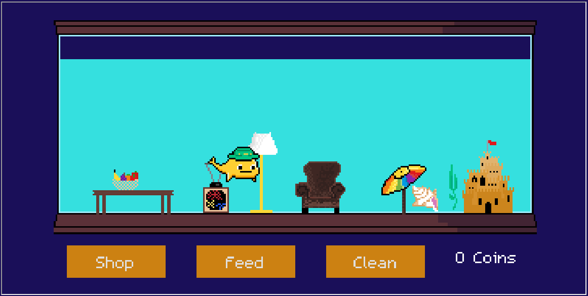

# Pixelnaut Pet Shop
Pixelnaut game for Solana Riptide Hackathon

> # Live demo at **[pixlenauts.shop](https://pixelnauts.shop)**

## Introduction
### How to Play
If you own one or more Orcanauts, connect your wallet and see your pet in the game window.
Switch between your different Orcanauts with the carousel.
Each one has a unique game. You can feed and clean your Orcanaut's tank to collect coins.
Use your coins to upgrade your tank and decorate it with items
- Make sure to feed your Pixelnaut every 24 hours (one minute in demo mode). You may get some coins, if you don't feed it too often, but if you wait to long you will lose all your coins.</li>
- Make sure to clean your Pixelnaut's tank every seven days (seven minutes for demo mode). You may get some coins, if you don't clean it too often, but if you wait to long you will lose all your coins.</li>
- Open the shop window to buy items. You can drag them around the tank to the perfect location.</li>
- Open the shop window to upgrade your tank. You will get more room to decorate.</li></ul>

## Running The Game Locally

### Game (this repo)
The game uses the [Godot](https://godotengine.org/) game engine. You will need to 
install this and download the tools for exporting games to HTML5 from within Godot.

### This game depends on the following two additional repos.

#### [Server](https://github.com/Baloguna16/pixelnaut-game-server) 

The server contains the game logic and persists the data for each orcanaut game in a database. 
Use the fy/game-logic branch. You must install mongodb and several Python packages.

#### [Web Front End](https://github.com/fuzzyyeti/pixelnaut-riptide)
The web frontend gives information about the game, allows a user to connect a wallet, 
and passes the Orcanaut information into the Godot game, which is embedded in the web application.
